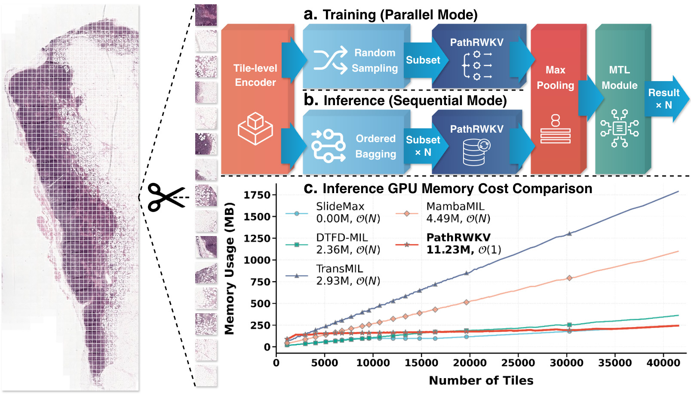
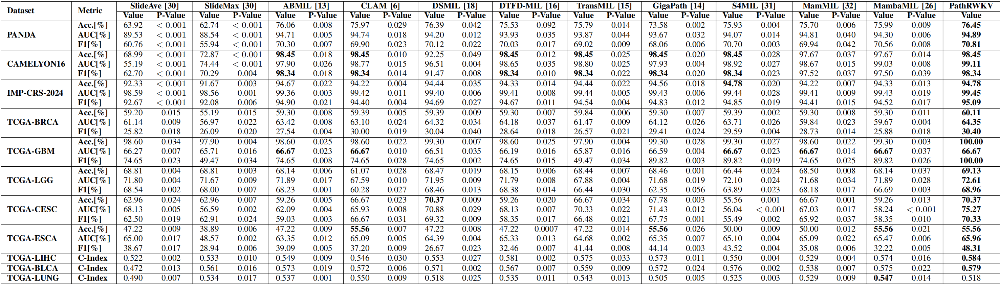
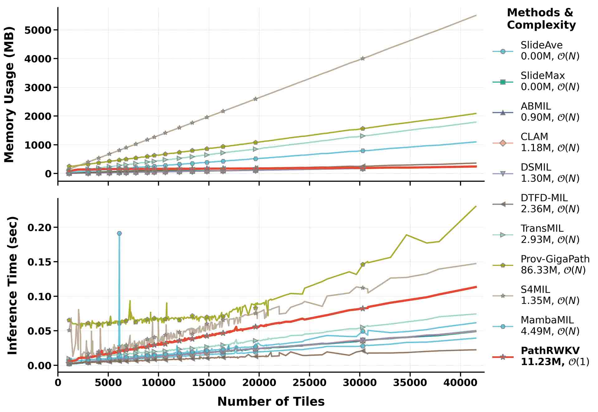
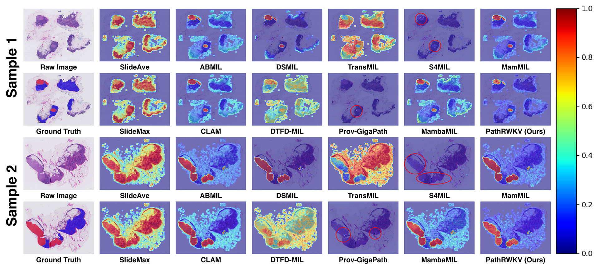
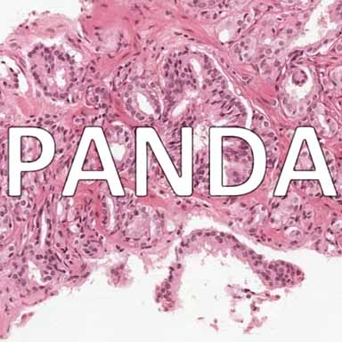
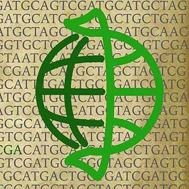

<div align="center">

# PathRWKV

### *Enhancing Slide Inference with Asymmetric Recurrent Modeling*

<!-- [](https://ieeexplore.ieee.org/) -->
[](https://arxiv.org/abs/2503.03199)
[](LICENSE)

[](https://python.org)
[](https://pytorch.org)
[](https://developer.nvidia.com/cuda-toolkit)

[](https://colab.research.google.com/github/Puzzle-Logic/PathRWKV/blob/main/demo.ipynb)
[](https://huggingface.co/PuzzleLogic)

<p align="center">
  <a href="#-highlights">Highlights</a> •
  <a href="#-architecture">Architecture</a> •
  <a href="#%EF%B8%8F-installation">Installation</a> •
  <a href="#-quick-start">Quick Start</a> •
  <a href="#-results">Results</a> •
  <a href="#-citation">Citation</a>
</p>

</div>

## 📢 News

|     Date      | News                                |
| :-----------: | :---------------------------------- |
| 🚀 **2026.02** | Code and pretrained models released |
| 📊 **2025.03** | Paper uploaded to arXiv             |

---

## ✨ Highlights
### ⚡ Asymmetric Structure: Constant Memory Footprint 
Unlike previous MIL methods with linear ($O(N)$) spatial complexity, PathRWKV achieves constant ($O(1)$) space complexity, enabling efficient processing of slides with **100,000+ tiles** on memory constrained edge devices.

<p align="center">
  
  <br>
  <em>Asymmetric structure and GPU memory footprint comparison during inference</em>
</p>

---

## 🏗️ Architecture

<p align="center">
  
  <br>
  <em>Overview of PathRWKV architecture</em>
</p>


### Key Innovations

| Component                                        | Description                                                           | Benefit                                                                                                            |
| ------------------------------------------------ | --------------------------------------------------------------------- | ------------------------------------------------------------------------------------------------------------------ |
| **Asymmetric Structure & Max Pooling**           | Parallelized training and sequential inference                        | Maintain high efficiency during training and low GPU memory footprint during inference                             |
| **Random Sampling & Multi-Task Learning Module** | Dynamic data augmentation technique and auxiliary supervision signals | Exploit the potential of limited annotations and bolster model generalizability                                    |
| **2D Sinusoidal Positional Encoding**            | Embed unique coordinate-based information                             | Bridge the gap between sampling-based training and sequential inference                                            |
| **TimeMix and ChannelMix Modules**               | Dynamically caputuring data-dependent multi-scale features            | Ensure modeling both fine-grained cellular details and coarse-grained global tissue heterogeneity across the slide |

---

## 🛠️ Installation

### Prerequisites
- **GPU**: NVIDIA GPU with CUDA 12.0+ (12.8 Recommended)
- **Python**: 3.12+ (3.12.12 Recommended)
- **PyTorch**: 2.9+ (2.9.1 Recommended)

### Demo on Google Colab

Click the badge below to open the demo notebook in Google Colab:

[](https://colab.research.google.com/github/Puzzle-Logic/PathRWKV/blob/main/demo.ipynb)

### Mamba/Conda Environment

```bash
# Clone the repository
git clone https://github.com/Puzzle-Logic/PathRWKV.git
cd PathRWKV

# Create mamba/conda environment
mamba env create -f environment.yaml
mamba activate pathrwkv_env
# conda env create -f environment.yaml
# conda activate pathrwkv_env

# Install Python dependencies
uv pip install -r pyproject.toml
```
---

## 🚀 Quick Start

```python
# 1️⃣ Preprocess WSI to tiles
python UpStream/preprocess.py \
    --input_dir /path/to/wsi \
    --output_dir /path/to/tiles \
    --edge_size 224 \
    --target_mpp 0.5 \
    --t_occupancy 0.1

# 2️⃣ Extract tiles-embeddings
python UpStream/embed.py \
    --input_dir /path/to/tiles \
    --output_dir /path/to/tiles-embeddings \
    --model_name "hf_hub:prov-gigapath/prov-gigapath" \
    --batch_size 512

# 3️⃣ Train & Val & Test PathRWKV
python DownStream/main.py \
    --data_path /path/to/tiles-embeddings \
    --dataset_name CAMELYON16 \
    --batch_size 4 \
    --max_tiles 2000 \
    --num_workers -1 \
    --epochs 100 \
    --lr 1e-3 \
    --precision "bf16-mixed" \
    --devices 0
```
---

## 📁 Project Structure

```
PathRWKV/
│
├── 📂 UpStream/                    # Preprocessing & Feature Extraction
│   ├── preprocess.py               # WSI → Tiles conversion
│   └── embed.py                    # Tiles → Embeddings extraction
│
├── 📂 DownStream/                  # Model Training & Evaluation
│   ├── main.py                     # Training/Testing entry point
│   ├── 📂 model/
│   │   ├── pathrwkv.py             # PathRWKV model implementation
│   │   ├── pe.py                   # Position encoding module
│   │   └── 📂 cuda/                # Custom CUDA kernels
│   │       ├── wkv6.cu             # WKV-6 parallel computation
│   │       └── wkv6state.cu        # State-based inference
│   ├── 📂 utils/
│   │   ├── dataset.py              # Data loading utilities
│   │   ├── pipeline.py             # Training pipeline
│   │   └── utils.py                # Helper functions
│   └── 📂 dataset_configs/         # Dataset-specific configurations
│
├── 📓 demo.ipynb                   # Interactive demo notebook
├── 📋 environment.yaml             # Conda environment specification
├── 📋 pyproject.toml               # Python project configuration
└── 📖 README.md                    # This file
```

---

## 📊 Results

### Performance Comparison

<p align="center">
  
</p>

### Efficiency Comparison

<p align="center">
  
</p>

### CAM Visualization

<p align="center">
  
</p>

---

## 📚 Supported Datasets

<table>
<tr>
<td align="center" width="20%">
<br>
<b>CAMELYON16</b><br>
</td>
<td align="center" width="20%">
<br>
<b>PANDA</b><br>
</td>
<td align="center" width="20%">
<br>
<b>TCGAs</b><br>
</td>
</tr>
</table>

### Utilizing Embedded CAMELYON16 Dataset

For convenience, the CAMELYON16 dataset embedded with Prov-GigaPath is hosted on the Hugging Face Hub. You can download it to your local machine for training or analysis using the huggingface_hub Python library:
```python
import os
from huggingface_hub import snapshot_download

repo_id = "PuzzleLogic/CAMELYON16_Embeddings"
local_dir = "./data/CAMELYON16/tiles-embeddings"

os.makedirs(local_dir, exist_ok=True)
path = snapshot_download(
    repo_id=repo_id,
    local_dir=local_dir,
    repo_type="dataset",
    resume_download=True
)
```

### Adding Custom Datasets

1. Create a configuration folder:
```bash
mkdir -p DownStream/dataset_configs/YOUR_DATASET
```

2. Add `task_configs.yaml`:
```yaml
all_task_dict:
  YOUR_TASK: cls  # cls, reg, or surv
tasks_to_run:
  - YOUR_TASK
label_dict:
  YOUR_TASK:
    class_0: 0
    class_1: 1
```

3. Add `task_description.csv` with your slide annotations.

---

## 🔧 Configuration

### Training Arguments

| Argument         | Default      | Description                                |
| ---------------- | ------------ | ------------------------------------------ |
| `--data_path`    | -            | Path to embedding directory                |
| `--dataset_name` | `CAMELYON16` | Dataset name                               |
| `--batch_size`   | `4`          | Training batch size                        |
| `--epochs`       | `100`        | Number of training epochs                  |
| `--lr`           | `1e-4`       | Learning rate                              |
| `--max_tiles`    | `2000`       | Max tiles per slide during training        |
| `--devices`      | `0`          | GPU device IDs (e.g., `0%1` for multi-GPU) |

### Model Hyperparameters

| Parameter   | Default | Description               |
| ----------- | ------- | ------------------------- |
| `embed_dim` | `768`   | Model embedding dimension |
| `n_layers`  | `2`     | Number of RWKV blocks     |
| `head_size` | `64`    | Attention head size       |

---

## 📄 Citation

If you find this work useful, please cite our paper:

```bibtex
@article{chen2025pathrwkv,
  title={PathRWKV: Enabling Whole Slide Prediction with Recurrent-Transformer},
  author={Chen, Sicheng and Zhang, Tianyi and Liao, Dankai and Li, Dandan and Han, Low Chang and Jiang, Yanqin and Jin, Yueming and Lyu, Shangqing},
  journal={arXiv preprint arXiv:2503.03199},
  year={2025}
}
```

---

## 📜 License

This project is licensed under the Apache 2.0 License - see the [LICENSE](LICENSE) file for details.

---

## 🙏 Acknowledgments

<table>
<tr>
<td align="center">
<a href="https://github.com/Puzzle-Logic/UnPuzzle">

</a>
<br><sub>Training Pipeline</sub>
<td align="center">
<a href="https://github.com/BlinkDL/RWKV-LM">

</a>
<br><sub>RWKV Architecture</sub>
</td>
<td align="center">
<a href="https://github.com/prov-gigapath/prov-gigapath">

</a>
<br><sub>Foundation Model</sub>
</td>
</tr>
</table>

---

<div align="center">

**⭐ Star us on GitHub — it motivates us a lot!**

<p>
  <a href="https://github.com/Puzzle-Logic/PathRWKV/stargazers">
    
  </a>
  <a href="https://github.com/Puzzle-Logic/PathRWKV/network/members">
    
  </a>
  <a href="https://github.com/Puzzle-Logic/PathRWKV/watchers">
    
  </a>
</p>

</div>
